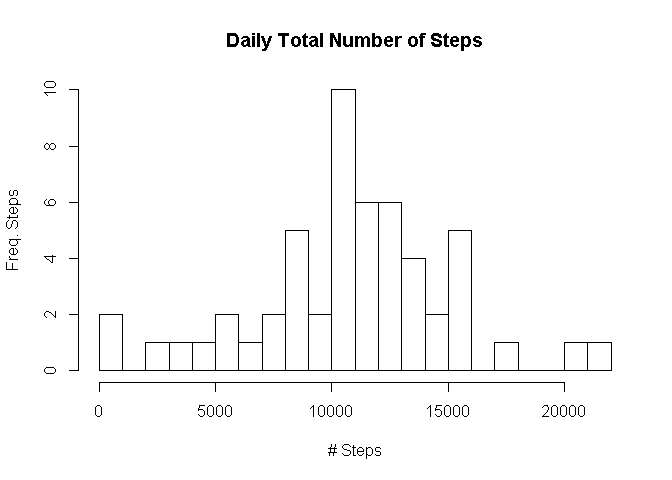
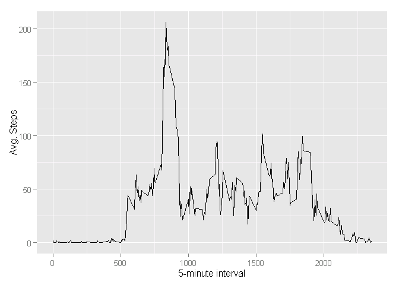
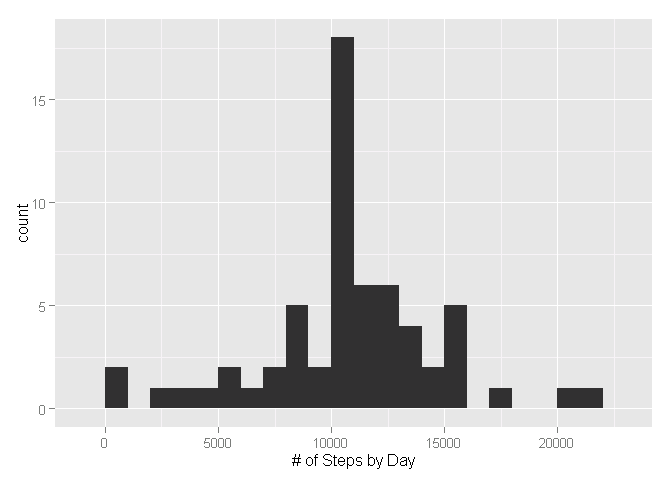
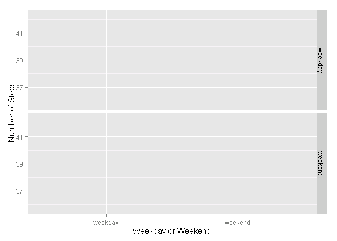

# Reproducible Research: Peer Assessment 1

## Loading and preprocessing the data

```r
library(ggplot2)
library(plyr)
library(lattice)
dataset <- read.csv("./activity.csv")
```

## What is mean total number of steps taken per day?

```r
dailytotal<-tapply(dataset$steps,as.character(dataset$date),sum,rm.na=TRUE)
hist(dailytotal,breaks = 30, main="Daily Total Number of Steps",ylab='Freq. Steps', xlab="# Steps")
```

 

```r
mean   <- mean(dailytotal, na.rm=TRUE)
median <- median(dailytotal, na.rm=TRUE)
```

## What is the average daily activity pattern?

```r
AvgDailySteps2 <- aggregate(x=list(steps=dataset$steps), 
                           by=list(interval=dataset$interval),
                            FUN=mean, na.rm=TRUE)
ggplot(data=AvgDailySteps2, aes(x=interval, y=steps)) +
  geom_line() +
  xlab("5-minute interval") +
  ylab("Avg. Steps")
```

 

## Imputing missing values

```r
# First check how many missing
missing <- is.na(dataset$steps)
table(missing)
```

```
## missing
## FALSE  TRUE 
## 15264  2304
```

```r
# FALSE  TRUE 
# 15264  2304 
# Replace missing values with 5-minute interval's mean
getvalue <- function(steps, interval) {
  temp <- NA
  if (!is.na(steps))
    temp <- c(steps)
  else
    temp <- (AvgDailySteps2[AvgDailySteps2$interval==interval, "steps"])
  return(temp)
}
dataset2 <- dataset
dataset2$steps <- mapply(getvalue, dataset2$steps, dataset2$interval)
# Check new dataset(2) again for how many missing
missing <- is.na(dataset2$steps)
table(missing)
```

```
## missing
## FALSE 
## 17568
```

```r
# FALSE 
# 17568 

ModifiedStepsDataset <- tapply(dataset2$steps, dataset2$date, FUN=sum)
qplot(ModifiedStepsDataset, binwidth=1000, xlab="# of Steps by Day")
```

 

```r
mean(ModifiedStepsDataset)
```

```
## [1] 10766.19
```

```r
median(ModifiedStepsDataset)
```

```
## [1] 10766.19
```
## Are there differences in activity patterns between weekdays and weekends?

```r
weekday.or.weekend <- function(date) {
  day <- weekdays(date)
  if (day %in% c("Monday", "Tuesday", "Wednesday", "Thursday", "Friday"))
    return("weekday")
  else if (day %in% c("Saturday", "Sunday"))
    return("weekend")
  else
    stop("invalid date")
}
dataset2$date <- as.Date(dataset2$date)
dataset2$day <- sapply(dataset2$date, FUN=weekday.or.weekend)
## ------------------------------------------------------------------------
AvgDailySteps3 <- aggregate(x=list(steps=dataset2$steps), 
                            by=list(day=dataset2$day),
                            FUN=mean, na.rm=TRUE)
ggplot(AvgDailySteps3, aes(day, steps)) + geom_line() + facet_grid(day ~ .) +
  xlab("Weekday or Weekend") + ylab("Number of Steps")
```

```
## geom_path: Each group consist of only one observation. Do you need to adjust the group aesthetic?
## geom_path: Each group consist of only one observation. Do you need to adjust the group aesthetic?
```

 
